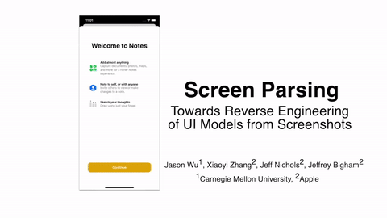

# Bonus Idea | Generative-based Co-pilot

| 🚀 Help the community improve the Penpot challenge! 🚀    | 
|---------------------------------------------------------------|
| 💡 Please feel free to share your valuable comments [here](https://github.com/penpot/Penpot-Bonus_Generative-based-Co-pilot/issues/1#issue-1780339544).|

## 🔎 Idea overview

Due to the limited academic and practical work done on the component and page as SVG generation, we propose the pivot of the idea. 

Instead of generating long SVG text files for each component, we can utilize controllable image generation to **generate the components or page visualization in the existing or target styles.** 

 

## 💡 Feature analysis
## Approach #1 | Generative-based Co-pilot 

The system will allow a user to generate an image of the component or the page based on the input style or layout mockup. 

| Technology readiness | Risks | Complexity |
| ----- | ----- | ---------- |
| 
 🟡 Some elements exist but require adaptation | 
 🟠 Higher than average  | 
 🟠 Moderately complex |

### Pipeline description

Step #1) Input mockup layout in the SVG format. It can be user-created or text-based generation using with [Challenge #1 | Text-to-layout generator](https://github.com/neurons-lab/Penpot-C1_Design-Co-pilot/tree/main/Approach%233-New_layout_generation)
    

Step #2) Based on the layout and text prompt, generate compatible images and texts via ControlNet [[Github](https://github.com/lllyasviel/ControlNet)].

Step #3) User pick several inspiring options for further SVG re-implementation

### Requirements

- ML model:
    - Text-to-layout generator: CLIP [[Github](https://github.com/OpenAI/CLIP)] + UNet
    - Layout-to-content generator: ControlNet [[Github](https://github.com/lllyasviel/ControlNet)] + UNet；GLIGEN [[Github](https://github.com/gligen/GLIGEN)]
- Input: text prompt
- Output: layouts and various complete designs
- Dataset:
    - Text prompt ↔ layout pairs: follow UI description [[Paper](references/research_papers/UIDescription.pdf)] to create
    - layout ↔ complete design pairs: [Rico’17](https://www.kaggle.com/datasets/onurgunes1993/rico-dataset)

### Relevant works

[Research]

- Apple’21 proposed “parsing layout into components” [[Website](https://blog.ml.cmu.edu/2021/12/10/understanding-user-interfaces-with-screen-parsing/)]

- LayoutDM [[Github](https://cyberagentailab.github.io/layout-dm/)]
- BoostingGUI :first tries on controllable page-generation [[Paper](references/research_papers/BoostingGUI.pdf)]
- UI description [[Paper](references/research_papers/UIDescription.pdf)]
- Text-to-image generator:
   - Latent Diffusion Model [[Paper](references/research_papers/LDM.pdf)] [[Github](https://github.com/CompVis/latent-diffusion)]

    - Composable-Diffusion: support compositional text prompt [[Website](references/research_papers/Compositional-Visual-Generation-with-Composable-Diffusion-Models.pdf)] [[Github](https://github.com/energy-based-model/Compositional-Visual-Generation-with-Composable-Diffusion-Models-PyTorch)]

    - ControlNet: adding more control by image/sketch [[Paper](references/research_papers/ControlNet.pdf)] [[Github](https://github.com/lllyasviel/ControlNet)] [[WebUI extension](https://github.com/Mikubill/sd-webui-controlnet)]

- Editing images:
    - GroundingDINO: regional image editing [[Github](https://github.com/IDEA-Research/GroundingDINO/blob/main/demo/image_editing_with_groundingdino_gligen.ipynb)]
    - Drag-your-GAN [[Website](https://vcai.mpi-inf.mpg.de/projects/DragGAN/)] [[Github](https://github.com/XingangPan/DragGAN)]
    - Edit Everything [[paper](references/research_papers/EditEverything.pdf)] [[Github](https://github.com/DefengXie/Edit_Everything)]

[Business Solutions]

- Microsoft Designer [[Website](https://designer.microsoft.com/)] [[Demo](https://youtu.be/vQK-E_Mzeq0)]

### Pros and Cons
    
🟢 Pros

- An existing high-quality open-source solution for image generation
- More research-active area

🔴 Cons

- Requires diverse new dataset and additional pre-processing
- Generation quality should be usable enough for the design application
